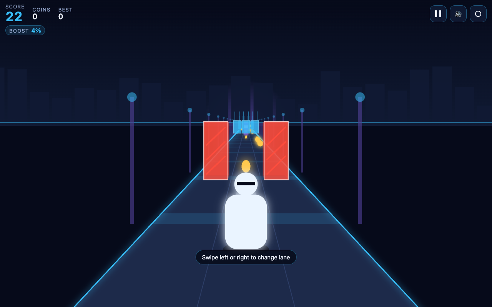
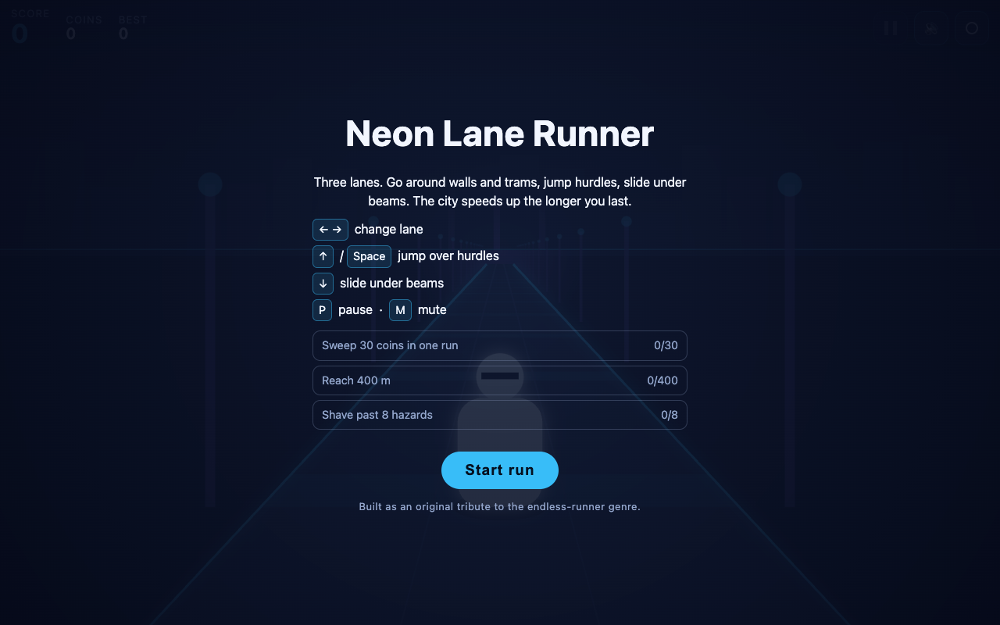
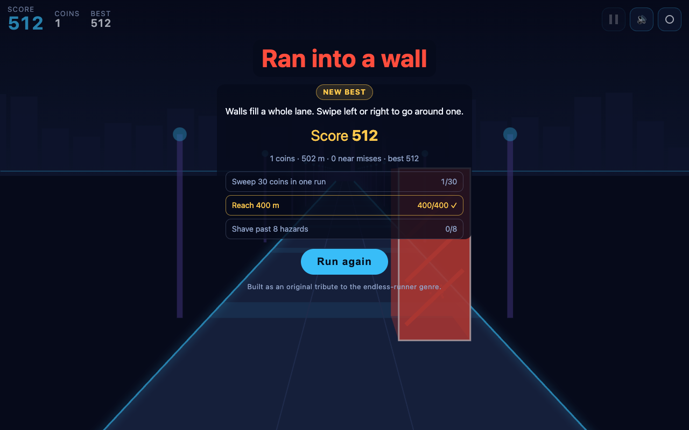
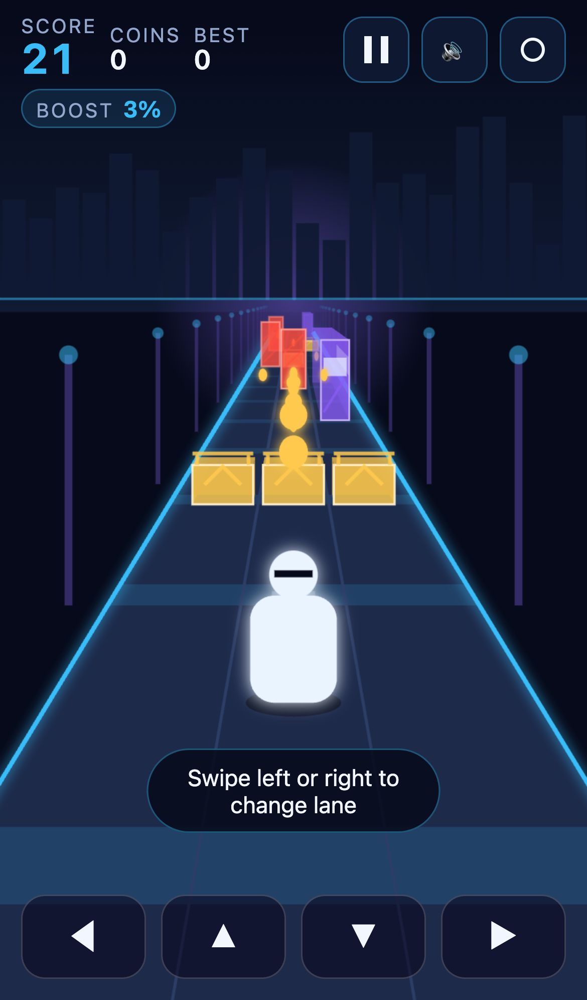

# Neon Lane Runner

A three-lane endless runner that plays in the browser on desktop and on a phone.
Sprint down a neon boulevard, swap lanes to dodge walls and trams, jump the
hurdles, slide under the overhead beams, and hoover up coins while the city
keeps getting faster.

TypeScript + Vite, rendered with a hand-rolled pseudo-3D projection on a single
Canvas 2D context. No game engine, no asset downloads, no required backend.



| Start screen | Game over | Mobile |
| --- | --- | --- |
|  |  |  |

## Gameplay

- **Three lanes.** The runner is locked to lane 0, 1 or 2 and slides between
  them in 0.13 s.
- **Four hazards**, each with its own required answer:
  | Hazard | Silhouette | Markings | Colour | Answer |
  | --- | --- | --- | --- | --- |
  | Wall | full-height slab, half-width 0.40 | white outline + three diagonal slashes | `#FF4D3D` | change lane |
  | Tram | narrowest (0.34) but 14 units deep | lit window band across the face and along the flank, 45° stripes | `#8A5CF6` | change lane early |
  | Hurdle | low and wide (0.43) | rail on two posts above the box, up chevron | `#FFC94D` | jump |
  | Beam | widest (0.45), suspended, never touches the road | two cables reaching up, down chevron underneath | `#38BDF8` | slide |

  Each one is identifiable with the colour removed: the silhouettes differ in
  proportion and the markings state the required answer. Warm hues are reserved
  for things that end a run — every decorative element in the scene is cool.
- **Coins** are worth 10 points each. Rows of them mark the safe lane, and the
  jump rows hang coins in an arc so clearing a hurdle pays off.
- **Score** = metres travelled + 10 per coin. Your best score is kept in
  `localStorage` and survives a reload.
- **The city accelerates.** Forward speed starts at 11 units/s and ramps by
  0.42 per second of survival up to a 34 unit/s cap — the `BOOST` readout in the
  HUD shows how far along that ramp you are.
- **Generated track.** Every row is drawn from eight hand-authored patterns via
  a seeded PRNG, and the generator never produces an unsolvable row (tested over
  400 seeds, see `spec.json` → `generationContract`).
- **Coin routes.** One pattern offers a choice: a short coin line in an open
  lane, or a longer one guarded by a hurdle you have to jump. Both routes avoid
  the wall, so the row stays solvable whichever you take — or neither.
- **Near misses** are counted and sparked when you squeeze past a hazard. They
  are feedback only and never touch the score, so leaderboard entries stay
  comparable with 1.0.0 runs.
- **Three optional missions** (30 coins, 400 m, 8 near misses) show on the menu
  and the game-over card. Nothing is gated behind them, and there are no
  streaks, ads or payments.

## Controls

| Action | Keyboard | Touch / pointer |
| --- | --- | --- |
| Change lane | `←` `→` or `A` `D` | swipe left/right, or the on-screen ◀ ▶ pads |
| Jump | `↑`, `W` or `Space` | swipe up, tap anywhere, or the ▲ pad |
| Slide | `↓` or `S` | swipe down, or the ▼ pad |
| Pause / resume | `P` or `Esc` | pause button in the HUD |
| Start / restart | `Enter` or `R` | the overlay button |
| Mute | `M` | speaker button in the HUD |
| Effects level | — | circle button in the HUD (full → reduced → minimal) |

Swipes are deliberate rather than hair-trigger: a gesture fires once it has
travelled 24 CSS px along one axis **and** that axis leads the other by 1.6×, so
a diagonal drag produces one action or none, never two. Recognition happens
mid-gesture, so a lane change starts the moment your thumb commits rather than
when you lift it. Only one pointer drives the game at a time, and
`pointercancel`, lost capture, window blur and tab hide all release a held
gesture. `touch-action: none` is scoped to the canvas and the pads, so overlay
menus keep normal touch behaviour.

The first run on a device gets a four-step coach shown over the live game — one
instruction at a time, each dismissed by doing the thing rather than by reading.

The on-screen pads are hidden on devices that report a fine pointer, so a
desktop browser gets a clean playfield. Switching away from the tab
auto-pauses.

## Install, dev, build

Requires Node 18+. `package-lock.json` is committed, so use `npm ci` for a
reproducible install.

```bash
npm ci            # install exactly what the lockfile pins
npm run dev       # dev server on http://localhost:5173
npm run build     # tsc --noEmit && vite build  ->  dist/
npm run preview   # serve the production build on :4173
npm test          # 25 unit tests (vitest)
npm run smoke     # browser smoke test against dist/ (needs `npx playwright install chromium`)
```

## Architecture

```
src/
  main.ts            binds DOM elements and boots the Game
  style.css          HUD, overlays, touch pads, responsive layout
  game/
    config.ts        every tunable constant + the fixed 1/120 s timestep
    types.ts         GameState, Obstacle, Coin, Player, Phase, Action
    logic.ts         PURE simulation: input, physics, spawning, collision, score
    render.ts        pseudo-3D Canvas 2D renderer, particles, screen shake
    audio.ts         Web Audio synthesis (no audio files ship with the project)
    input.ts         keyboard + pointer/swipe wiring
    storage.ts       localStorage best score and mute preference
    game.ts          frame loop, phase/overlay orchestration, HUD updates
tests/logic.test.ts  unit tests over the pure simulation
scripts/smoke.mjs    Playwright smoke test + screenshot capture
```

Two deliberate choices shape the code:

**The simulation is pure and separate from the renderer.** `logic.ts` touches no
DOM and no clock. It advances a plain `GameState` object by a fixed
`1/120 s` step, so the same input sequence always produces the same run — that
is what makes collision, scoring and generation testable without a browser.
`advance()` splits a variable frame delta into fixed sub-steps and clamps a
single call to 0.25 s, so returning to a backgrounded tab cannot teleport the
runner through a wall.

**The 3D is a projection, not an engine.** The camera sits 6.2 units behind and
2.55 units above the runner. `project(lane, y, z)` divides by depth to get a
screen point, and everything — road, lane dividers, obstacle cuboids, coins,
rails — is painted from that one function, far to near. Portrait viewports pull
the camera back to 8.6 units and shorten the focal length, so a tall, narrow
phone screen shows useful road ahead instead of filling up with the runner.

Presentation and simulation communicate through a small one-shot `events` queue
(`jump`, `slide`, `lane`, `coin`, `crash`) that the frame loop drains into sound
effects, coin sparks and screen shake.

## Measured before / after

Baseline is commit `66063a4` built from a clean `npm ci`; "after" is this
branch. Both were driven by the **same** scripts (`scripts/shots.mjs`,
`scripts/perf.mjs`), which touch only the public state and input, at seed
`20260908` across five viewports. Raw output is in
[`docs/evidence/`](docs/evidence).

> **These are Chromium-on-macOS numbers, not phone numbers.** The viewport and
> DPR are emulated. No physical iPhone or Android device was tested. See
> [Known limitations](#known-limitations).

| Check | Before (`66063a4`) | After | How |
| --- | --- | --- | --- |
| Touch targets under 44 px | `pause` 40×40, `mute` 40×40, on all 5 viewports | none | `getBoundingClientRect` on every visible button |
| Controls off-screen or covered | none reported — but the check could not see it | none | `elementFromPoint` at each control's centre |
| Game-over headline | `New best run!` on all 5 viewports, cause not recorded | `Ran into a wall` / `Tripped on a hurdle` / `Hit an overhead beam` | read from the live overlay |
| Runner occludes next hazard | yes — 12.29 world units, past the 11-unit row gap | no — 5.75 units | closed form in `hazardVisibilityZ`, asserted in tests |
| Horizontal overflow | 0 px | 0 px | `scrollWidth - clientWidth` |
| Canvas backing store / CSS px | 2.0 mobile, 1.0 desktop | 2.0 mobile, 1.0 desktop | `canvas.width / rect.width` |
| Console + page errors | 0 | 0 | Playwright listeners |
| Mean frame rate, 60 s after 5 s warm-up | 60.00 fps over 3601 frames | 60.00 fps over 3601 frames | `scripts/perf.mjs` |
| Frame interval p50 / p90 / p99 / max | 16.7 / 16.7 / 16.8 / 16.8 ms | 16.7 / 16.7 / 16.8 / 16.8 ms | same |
| Frames over 20 ms / over 33 ms | 0 % / 0 % | 0 % / 0 % | same |

The occlusion fix is the one with a proof rather than a screenshot. The runner
is drawn at `z = 0`; requiring a hazard's foot to project above the runner's
head cancels both focal length and horizon, leaving

```
hazardVisibilityZ = playerHeight × camBack / (camHeight − playerHeight)
```

Portrait ran `camBack 8.6 / camHeight 2.55` → **12.29**, which is *further* than
`rowGapMin = 11`, so the next hazard row could sit behind the runner. It now
runs `9.2 / 3.9` → **5.75**. Landscape and desktop were already clear at 8.86
and are unchanged. `tests/mobile.test.ts` asserts this for all five viewports
and cross-checks the closed form against a hand-written projection.

Compare [`docs/evidence/before-390x844-play.png`](docs/evidence/before-390x844-play.png)
with [`docs/evidence/after-390x844-play.png`](docs/evidence/after-390x844-play.png):
same seed, same score, same viewport. In the first the runner's body covers all
but the top edge of the amber hurdle in its own lane.

### What the measurements do *not* show

- **There was no frame-rate problem to fix.** The baseline already held 60 fps
  with the same interval distribution, so the effect budget and the particle
  pool are a bound on worst-case behaviour and a guard against future
  regression — not a measured speed-up. Claiming otherwise would be wrong.
- **The heap trend could not distinguish the two builds.** Both report 9766 KB
  at the first and last of 60 samples, even though the baseline allocates
  particle objects every frame and this build allocates none.
  `performance.memory.usedJSHeapSize` is too coarse here to resolve that
  difference, so the flat reading is *not* evidence that the pool works. The
  pool is verified by reading the code and by `liveParticles()` staying at or
  below the 64-slot pool size, not by this number.
- **Headless Chromium's frame pacing is more regular than a real device's.** A
  p99 equal to p50 is a property of this harness, not a promise about a phone.
- The scripted pilot restarted 1× on the baseline and 5× on this build inside
  the same 60 s. That is a shift in the hazard mix from the added eighth row
  pattern, which puts a hurdle in a coin lane; solvability is still asserted
  over 400 seeds. It is a bot artefact and says nothing about human difficulty.

## Verification

Commands and their results on macOS 15 (Darwin 25.5.0), Node v24.13.0:

```
$ npm run build
✓ tsc --noEmit clean
✓ built in 106ms  dist/assets/index-*.js 30.24 kB (gzip 10.82 kB)
                  dist/assets/index-*.css 6.49 kB (gzip 2.16 kB)

$ npm test
✓ tests/arcade.test.ts (7 tests)
✓ tests/logic.test.ts  (25 tests)
✓ tests/mobile.test.ts (17 tests)
  Test Files  3 passed (3)
       Tests  49 passed (49)

$ npm run smoke
39/39 checks passed

$ npm run shots      # 5 viewports x 3 screens + a metrics report
$ npm run perf       # 60s frame-interval distribution after warm-up
```

The 25 original logic tests are unchanged and still pass, which is the check
that matters most for the scoring change: near misses and missions are additive,
so `score` is still exactly `floor(distance) + 10 x coins`.

`tests/mobile.test.ts` adds 17 tests: the portrait/landscape camera choice for
each of the five acceptance viewports; that `hazardVisibilityZ` is below
`rowGapMin` on all of them; that it at least halves the pre-fix 12.29; a
hand-written projection cross-check of the closed form either side of the
boundary; swipe classification below, at and past the threshold in all four
directions; that a 45 degree drag yields no action rather than two; that no
returned direction can come from an axis below the threshold (swept over a
41x41 grid of offsets); that a near miss and a collision are mutually exclusive
(swept across the obstacle at 0.01 lane steps); that the near-miss ledger stays
bounded as obstacles are culled; that the score formula is untouched after 3600
steps; and that across 400 seeds every generated row leaves an answerable lane
and no lane ever holds a hurdle and a beam at overlapping depth.

The 25 unit tests cover: lane changes and edge clamping, no double-jump, jump
apex and landing, slide expiry, that a jump clears a hurdle while a slide does
not, that a slide clears a beam while standing does not, obstacle-vs-lane and
obstacle-vs-depth collision, distance + coin scoring, single-count coin pickup,
the speed ramp and its cap, best-score capture on death, the frame-delta clamp,
that pause and game over freeze the world, full run reset preserving the best
score, and 800 generated rows asserted solvable and internally consistent.

The smoke test boots the **production build** in Chromium at 1280×800 and at an
emulated iPhone 13, and for each viewport asserts: canvas fills the viewport,
start overlay shows and hides, frames render, distance advances, the track
populates, the HUD matches the score, each key moves the runner as expected,
jump leaves the ground and lands, slide engages, a coin in reach increments both
the counter and the HUD, pause freezes the simulation with zero drift, resume
works, mute persists to `localStorage`, a planted wall ends the run and writes
the best score, restart resets distance and coins while keeping the best, and no
console or page errors occur. Screenshots in `docs/` come from that run.

## Source reference

Inspired by the endless-runner genre popularised by **Subway Surfers**
(<https://apps.apple.com/us/app/subway-surfers/id512939461>), used purely as a
genre reference for the three-lane / jump / slide / coin loop.

No branding, artwork, audio, level data, characters or names from that game are
used or reproduced here. Neon Lane Runner's name, visual design, level
generation patterns, tuning and code are original to this project.

## Asset credits & licence

There are no third-party assets. Everything is generated at runtime:

- **Graphics** — drawn procedurally with Canvas 2D paths and gradients. The
  skyline silhouette comes from a fixed integer LCG so the backdrop is stable.
- **Audio** — synthesised on demand with the Web Audio API (oscillators plus a
  filtered noise buffer). No audio files ship with the project.
- **Fonts** — system font stack only.
- **Icons** — Unicode characters and an inline SVG favicon.

Code and assets are MIT licensed (see [LICENSE](LICENSE)).

## Known limitations

- Pseudo-3D only: there is no depth buffer, so overlap is resolved by painting
  back to front. Two obstacles at nearly identical depth in adjacent lanes can
  briefly z-fight at their shared edge.
- Audio needs a user gesture before it starts (a browser autoplay rule), so the
  first sound arrives with the first tap or key press.
- The best score is per-browser `localStorage` when the game runs standalone. It
  silently does not persist in private-browsing modes that block storage.
- Leaderboards and cloud save only exist when the Arcade platform serves the
  game (see below); standalone builds keep working exactly as before.
- Difficulty ramps on time alone. Row patterns are drawn uniformly at random, so
  the mix of hazards does not get harder as speed rises — only the reaction time
  shrinks.
- No power-ups, no character selection and a single environment theme.
- **No physical-device testing.** Every measurement below comes from Chromium
  driven by Playwright on an Apple M1 laptop, with the viewport and DPR emulated.
  An emulated iPhone is not an iPhone: real Safari has its own compositor, its
  own Web Audio unlock behaviour and its own dynamic browser chrome. Real iOS
  Safari and real Android Chrome are **untested**. Firefox is untested too.
- The measured frame timings are therefore an upper bound on what a phone will
  do, not a prediction of it, and no FPS figure here should be read as a
  guarantee on device.
- Landscape phones work and are covered by the acceptance sweep, but the HUD and
  pads are tuned for portrait.
- The scripted pilot in `scripts/shots.mjs` and `scripts/perf.mjs` is capture
  scaffolding, not an AI opponent, and not a playtester. It reaches roughly 60 m
  before it misjudges a row. Its deaths say nothing about the game's difficulty
  and nothing about what a person would experience.
- No human playtesting has been done, so no claim is made about retention,
  learning speed or how well the cause-of-death message actually teaches.
  `research.md` records a falsifiable hypothesis and a protocol for testing that
  with real players; it has not been run.

## Arcade platform

The game is playable as a plain static bundle with no server at all. When it is
served by the Arcade platform it additionally gets a leaderboard and cloud save.

- `arcade.toml` declares the manifest: `mode = "offline"`, boards `daily` and
  `alltime`, `client_dir = "dist"` (this is a Vite build, so the static files are
  in `dist/`, not the repo root).
- `public/vendor/arcade.js` is the platform SDK, `public/arcade-bridge.js` the
  shim that exposes `window.ArcadeGame`, and `src/game/arcade.ts` the typed
  wrapper the game calls.
- The bridge only activates when the page is actually served by the platform
  (path `/g/<id>/`, or an explicit `window.ARCADE_BASE_URL`). Anywhere else it
  issues no requests at all, so a standalone deploy stays silent instead of
  logging 404s for an API that is not there.
- Every platform call swallows its own errors. If the platform is down the game
  behaves exactly as it did before this integration.

Tests:

```
npm test            # unit, includes the bridge fallback contract
npm run smoke       # browser, platform deliberately absent
npm run smoke:arcade [baseUrl]   # browser, against a running platform
```

`smoke:arcade` proves the parts the other two cannot: guest auth against the real
API, a finished run reaching both boards and reading back, and the personal best
returning from cloud save after the local copy is deleted.
